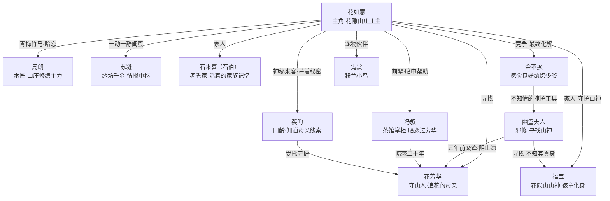

# 05 人物关系图

#花开寻踪 #人物关系 #关系图

← [[花开寻踪 MOC]]

---

## 全角色关系总图

---

## 关系说明

### 围绕花如意的关系层次

| 关系层      | 人物                                                                             | 关系性质           |
| -------- | ------------------------------------------------------------------------------ | -------------- |
| **核心家人** | [[03 NPC-正面配角#石来喜（石伯）\|石伯]]、[[03 NPC-正面配角#福宝\|福宝]]、[[02 主角设定#花芳华（缺席的母亲）\|花芳华]] | 血缘与家族情感        |
| **青梅竹马** | [[03 NPC-正面配角#周朗\|周朗]]                                                         | 六年守候，踏实的感情     |
| **闺蜜知己** | [[03 NPC-正面配角#苏凝\|苏凝]]                                                         | 一动一静，互补型友情     |
| **神秘来客** | [[03 NPC-正面配角#裴昀\|裴昀]]                                                         | 信任危机 × 情感吸引    |
| **前辈导师** | [[03 NPC-正面配角#冯叙\|冯叙]]                                                         | 以芳华为纽带的间接守护    |
| **喜剧对手** | [[04 NPC-反派与特殊角色#金不换\|金不换]]                                                    | 竞争 → 误会 → 意外化解 |
| **真正对手** | [[04 NPC-反派与特殊角色#幽篁夫人\|幽篁夫人]]                                                  | 因芳华而起的二十年纠葛    |

### 所有人与花芳华的关系

| 人物 | 与芳华的关系 |
|------|------------|
| 花如意 | 女儿，寻找她 |
| 石伯 | 一辈子的管家，替她守着一切 |
| 福宝 | 芳华从山外带回的孤儿 |
| 裴昀 | 受托照看花如意的晚辈 |
| 冯叙 | 暗恋了二十年，从未说出口 |
| 幽篁夫人 | 旧识，误会追查了二十年 |

---

## 相关文档

- 各角色详细设定 → [[03 NPC-正面配角]] · [[04 NPC-反派与特殊角色]]
- 角色速查 → [[06 角色速查表]]
- 围绕芳华的线索 → [[12 幕后线索彩蛋]]
