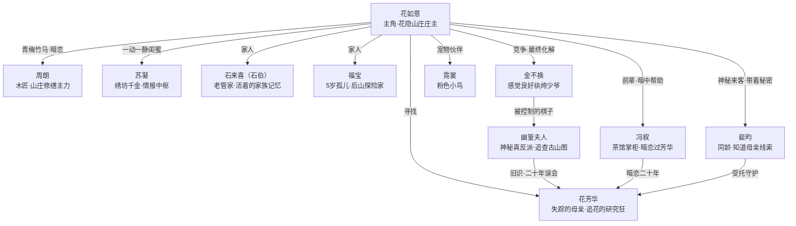

# 《花开寻踪》游戏设定文档

> **整理自：** AI 协作设计记录  
> **目标用户：** 18–25 岁女性玩家  
> **参考结构：** 《浪漫餐厅》玩法逻辑  
> **调性参考：** 《武林外传》喜剧底色  

---

## 一、核心定位

### 一句话定位

> **一个爱乱跑的娘、一座慢慢开花的旧庄子、几个凑在一起闹腾的年轻人，和仙湖镇每天鸡毛蒜皮又暖到心里的日子。**

### 情感内核

| 维度 | 内容 |
|------|------|
| **目标用户** | 18–25 岁女性 |
| **情感内核** | 初次独立面对一切 + 母女羁绊 + 自我成长 |
| **故事背景** | 中国古代（明初），江南小镇，烟雨山水 |
| **驱动悬疑** | 母亲失踪，山庄背后藏着什么秘密？ |
| **重建物** | 破旧山庄（含茶室、药庐、书楼、花圃等） |
| **爱情张力** | 青梅竹马 × 神秘来客 × 各怀心事的同龄人 |
| **美学风格** | 古风田园·治愈·接地气 |

### 调性关键词

**美好（花）/ 治愈 / 田园 / 接地气 / 笑着笑着就感动了**

不往黑深惨走，问题要有，解决问题的过程要有趣；冲突往往源于误会和沟通不畅；最终的解决从不依靠对抗，而是靠人心和一顿饭。

---

## 二、世界观设定

**时代背景：** 明初，江南水乡，商贾文化与江湖势力并存，女性可自营医馆绣坊。

**核心地点：** **仙湖镇** — 依山傍水的小镇，镇郊山腰上有一座废弃山庄。

**山庄全名：花隐山庄**

> 因山中百年前自然生长出一片"幽兰草"（极稀有的药材，花期极短，仅在特定年份盛开）而得名。主角母亲毕生研究其药性，留下大量手记，也因此引来觊觎。

**世界氛围关键词：** 百花常开、山中岁月、日常快乐、探索谜团

### "花"主题贯穿全局的设计逻辑

| 层次 | 体现方式 |
|------|---------|
| **人物命名** | 主角及家族以花为名，正派配角带草木意象 |
| **场所命名** | 山庄各院落以花命名，修缮后"花开"解锁新剧情 |
| **母亲线索** | 母亲失踪前种下的各种花卉隐藏线索，"花开时节"触发关键记忆 |
| **悬疑核心** | 山庄稀有药花"幽兰草"是反派觊觎的真实原因 |
| **玩法机制** | 合并玩法产出"花种" → 种植 → 开花 → 解锁剧情章节 |

---

## 三、主角设定

### 花如意

| 基础信息 | 内容 |
|---------|------|
| **性别** | 女 |
| **年龄** | 18 岁 |
| **职业** | 花隐山庄庄主（继承中） |
| **服装关键色** | 浅杏色为底、白色为辅，袖口领口绣小碎花；常年有一处沾着泥或草渍，永远是刚干完活的样子 |
| **随行** | 粉色小鸟霓裳，几乎不离肩 |

**性格：**  
好奇心旺、行动先于思考、嘴硬心软。清醒但冒失——知道自己要做什么，过程总出岔子。不爱认输，但会认错。对熟悉的人话多，对陌生人沉得住气。

**口癖：**
- "我来弄！"（然后帮倒忙）
- "没事，我会的。"（然后发现不会）
- "……好吧，你说得对。"（认输，但语气很快）

**成长弧光：**
```
归来的困惑少女
  → 扛起庄子的小庄主
    → 第一次理解"娘为什么要走"
      → 不再是寻母的孩子，是花隐山庄的花如意
```

**母亲：花芳华**

> 医术精湛、游走江湖的女大夫，一生痴迷研究"幽兰草"的药性，性格温柔却有铁骨。她是一个**学术型"野外研究狂人"**——发现了一株在异常节气里开花的幽兰草，觉得这是百年难遇的研究机会，"出门看一眼"然后一路追着花期走远，顺便又发现了几种没有记录的草药，一路记录一路走，等她回过神来，已经走了三个省……她完全没意识到家里的人急成什么样，偶尔托人带回口信，内容都是："一切安好，发现新物种，附上图样，请帮我查对一下是否有记载。"（没有一封提到"我什么时候回来"）

---

## 四、NPC 群像

### 正面配角

---

#### 石来喜（石伯）— "世界上最慢的快递"

| 基础信息 | 内容 |
|---------|------|
| **性别** | 男 |
| **年龄** | 约 65 岁 |
| **职业** | 花隐山庄老管家，在花家服侍了一辈子 |
| **服装关键色** | 深灰色旧棉袍，领口袖口浅蓝滚边，总穿得整整齐齐；腰间别着一串钥匙，走路轻响 |

**性格：**  
老实、忠厚、礼数严，没什么心眼，一辈子认准了一件事就做到底。记性越来越差，越重要的东西越容易忘——等到某个契机被触发，才拍脑袋想起来，自己也不明白为什么是这样。对花如意藏着极深的疼爱，但表达方式是热粥和唠叨。

**口癖：**
- "夫人说……"（说着说着停下来，想一会儿，再接着说）
- "老奴这就去。"
- "小小姐，这是……夫人让老奴转交的。老奴……忘了。"（每次说完，低头片刻）

**健忘触发机制：**  
芳华走之前托付给石伯很多东西，嘱咐他"适时"交给花如意。玩家完成一处院落修缮、解锁一个新区域，石伯在现场看着，忽然像被什么东西砸了一下，拍脑袋，颤颤巍巍地捧出一个东西来：

> "小小姐，这是……小姐让我转交给你的东西。"  
> （停顿）  
> "老奴早该给你的。老奴……忘了。"

**成长弧光：**
```
独自守庄六年，只有福宝和一座空庄子
  → 花如意归来，像压了多年的石头终于可以放下
    → 庄子一处处修好，记忆一件件被唤醒，使命一点点交还
      → 终章：把最后一件东西递出去，说"老奴这次没忘"
```
核心转变：他的弧光不是成长，是**放下**——守了一辈子，终于可以不用再一个人扛着了。

---

#### 福宝 — "后山第一探险家"

| 基础信息 | 内容 |
|---------|------|
| **性别** | 未知 |
| **年龄** | 5 岁 |
| **来历** | 六年前花芳华从山外带回的孤儿，不知父母，由石伯抚养至今 |
| **服装关键色** | 嫩草绿小袄，下摆绣歪歪扭扭的小花（她自己绣的），头上两个小揪揪，常有一边散掉 |

**性格：**  
只有 5 岁，但说出的话时常让大人发愣。对后山比对庄子热情得多，能看见旁人看不见的山中精怪，视为寻常朋友，毫不稀奇。行事大胆，丢了都不知道自己去哪了。镇上有人私下小声议论：这孩子……到底是不是人？

> **剧情悬疑线：** 福宝身世成谜，她的来历、她看见精怪的能力、她偶尔说出的"不像 5 岁孩子的话"——是天资聪颖，还是本就不是寻常人？游戏不给明确答案，留白给玩家。

**口癖：**
- "我知道！"（不一定真的知道，但非常确定地说）
- "后山那边有——"（十句话里六句开头是这个）
- "娘说……"（说到一半有时停，但很快接着说完，不沉浸在难过里）

**后山精怪设定：**

| 精怪 | 外形 | 性格 | 与福宝的关系 |
|------|------|------|------------|
| **苔小团** | 长得像一团会动的青苔，圆滚滚 | 认生，一有动静就缩成球 | 福宝第一个发现的，现在会主动爬到她肩上 |
| **花灯儿** | 像萤火虫但是白色，在花丛中飞 | 喜欢跟着人，不喜欢被抓 | 福宝叫它"灯灯"，它不承认但总在她附近 |
| **石爷爷** | 一块常年坐在溪边的老石头，偶尔睁眼 | 古板话少，爱发呆 | 福宝每天跟他说话，他大多数时候不回应，但有一次福宝摔跤，他伸出了一块凸起的石角让她扶 |

**成长弧光：**
```
守在空庄里等娘回来的小小孩
  → 有了如意姐姐，庄子开始像个家
    → 从等待变成主动出发，带大家去发现后山的好东西
      → 终章：娘回来了，她跑上去，第一句话是"娘，我给你介绍我的朋友"
```
核心转变：从**等待**到**出发**。

---

#### 周朗 — "有担当的帅大哥"

| 基础信息 | 内容 |
|---------|------|
| **性别** | 男 |
| **年龄** | 20 岁 |
| **职业** | 仙湖镇木匠，家传手艺，镇上公认手最巧 |
| **服装关键色** | 靛蓝色短褂，肩宽，袖子永远是挽起来的；身上有松木香和淡淡汗味，工具袋随身，腰间别着刨子 |

**性格：**  
开朗正直，说话直接，天然有担当感——不用开口，他已经站在最需要有人站的地方了。遇事不慌，是花如意"闯出麻烦"之后最先解决麻烦的那个人。对花如意有感情，既不掩藏也不急于表白，踏踏实实地等着合适的时候说。帅，是那种干完活抬起头来、汗水未干的帅。

**口癖：**
- "交给我。"（有事主动接，不问为什么）
- "放心。"（两个字，比任何保证都有分量）
- "我去看看。"（花如意还没说完，他已经起身了）

**代表场景：**

> 花如意（挽袖子）："周朗，我来帮你抬这根梁——"  
> 周朗：（把她拦住）"不用。"  
> 花如意："你一个人怎么抬？"  
> 周朗：（沉默两秒，指了指旁边的滑轮装置）"……我做了工具。"  
> 花如意："哦。"（停顿）"那我去帮你递钉子？"  
> 周朗：（把钉子袋挂到自己腰上）"不用。"

**成长弧光：**
```
花如意不在的六年，每年来庄子帮石伯修葺，没人问他为什么
  → 花如意回来，做了六年的事终于有了意义
    → 从"帮如意扛下所有事"到"学会相信她也可以"
      → 终章：花如意问"你等了这么久，不委屈吗"，他想了一下，说"没有"，顿一顿，"值得等"
```

---

#### 苏凝 — "安静的知己"

| 基础信息 | 内容 |
|---------|------|
| **性别** | 女 |
| **年龄** | 18 岁 |
| **职业** | 苏氏绣坊千金，家里是镇上最大的绣坊 |
| **服装关键色** | 月白色或浅竹青色为主，衣料素净，不多余的装饰；发髻梳得干净，只用一根素木簪，安安静静的样子 |

**性格：**  
话少，但观察力极强，说出来的每句话都很准。不主动打听，但大家都愿意来找她说话（她是个好的倾听者），情报自然汇集到她那里。表达喜欢不用言语——某天早上，花如意发现床头放着一套配好的衣裳，颜色正好，针脚匀称，没有署名。与花如意是一动一静，她的存在让花如意的热闹有了一个可以落回来的地方。

**口癖：**
- "……嗯。"（听完别人说话后，安静回应的第一个字）
- "你看这个。"（不说话，直接把做好的东西递过来）
- （偶尔说出一句一针见血的话，然后若无其事地继续绣手里的东西）

**成长弧光：**
```
安静地陪在花如意身边，几乎不发声
  → 发现自己不动声色收集的消息成了关键线索
    → 第一次主动开口，说出一件她观察了很久却从未说过的事
      → 终章：花如意说"你其实什么都懂"，苏凝低头继续绣，嘴角动了一下
```

---

#### 裴昀 — "同龄最帅，带着秘密的来客"

| 基础信息 | 内容 |
|---------|------|
| **性别** | 男 |
| **年龄** | 19 岁 |
| **职业** | 来历不明的游历少年，以"借宿客人"身份住进山庄 |
| **服装关键色** | 雪白色外衫，内衬浅灰，腰间一块碧色暖玉；衣料质地与庄子里其他人明显不同，但他在庄子住久了之后，衣领会慢慢松开一点 |

**性格：**  
同龄人里气质最出挑的一个，好看得让人想多看一眼，但他自己浑然不觉。看起来经历过比这个年纪更多的事。知道花芳华失踪的部分真相，有自己的顾虑，不急于说出来。被庄子的热闹一天天"化"着，最初是"这里真吵"，后来是每天准时出现在最热闹的地方。

**口癖：**
- "有意思。"（被庄子各种突发状况波及时的第一反应，说的时候嘴角有一点弧度）
- "……还好。"（被问到自己是否习惯庄子生活时，说得比预期快一点）
- （被福宝盘问感情问题时沉默两秒，然后说）"你几岁？"

**代表场景：**

> 顾辞客（第七天，对着镜子整理衣冠，平静地问花如意）："这里……一直是这样的吗？"  
> 花如意（毫不犹豫）："对。"  
> 裴昀沉默了一会儿。  
> "……那倒也挺好。"

**成长弧光：**
```
带着秘密和使命来到庄子的少年
  → 以为住几天就会离开，却一天天留了下来
    → 庄子的热闹填进了他身上某处空着的地方
      → 终章：主动说出他知道的一切——不是因为使命，是因为他选择了这里
```

---

#### 冯叙 — "茶馆掌柜，压了二十年感情的男人"

| 基础信息 | 内容 |
|---------|------|
| **性别** | 男 |
| **年龄** | 38 岁 |
| **职业** | 仙湖镇"听雨阁"茶馆掌柜，镇上最有阅历的男性商人 |
| **服装关键色** | 灰蓝色长衫，腰间常系一条布围裙，袖口有茶渍洗不净；头发束得随意，有几缕散落 |

**性格：**  
处事圆滑，说话留余地，见过世面但不炫耀。他年轻时暗恋过花芳华，从未说出口，后来花芳华嫁人、生女、失踪，那段感情就压在心里，成了一块化不开的东西。看见花如意，像看见芳华年轻时，心里又高兴又难受。给花如意的建议大多是对的，但自己的事一团糟，成了花如意的"反面教材式前辈"。

**口癖：**
- "你娘啊……"（说到一半，停下来，端起茶碗）
- "当年……"（又说了半句，又停了）
- "进来喝杯茶。"（他表达关心的方式，不管发生什么事，先喝茶）

**成长弧光：**
```
把对芳华的感情压了二十年，化成茶叶沉在壶底
  → 花如意回来，他终于有了可以做点什么的机会
    → 把那份藏了很久的感情，转换成帮这个孩子找到她娘的行动
      → 终章：花如意母女重逢，他站在茶馆门口看着，转身进去，把那壶茶彻底倒了，重泡一壶新的
```

---

### 反派阵营

---

#### 金不换 — "感觉良好先生"

| 基础信息 | 内容 |
|---------|------|
| **性别** | 男 |
| **年龄** | 22 岁 |
| **职业** | 金玉山庄少庄主，家业靠父亲，本人更擅长斗鸡走马 |
| **服装关键色** | 大红、明黄、描金——颜色永远最响，配饰永远比场合隆重三个等级 |

**性格：**  
永远活在"我已经赢了"的自我叙事里。计划周详、执行一塌糊涂。每次登门前在心里演练三遍，实际开口后第一句话就跑偏了。本质不坏，只是从小被惯坏、被幽篁夫人拿捏着，蠢过头了显出几分可怜。在花隐山庄屡战屡败，回去路上屡败屡战，"下次一定"说了二十几次。

**固定喜剧结构：**

```
金不换内心独白："今天必胜，我准备得很充分。"
      ↓
登门，被石伯以最隆重的礼节迎进去，喝了两盏茶
      ↓
福宝跑来问他"你今天又来干嘛"
      ↓
他刚要开口，霓裳飞过来停在他头上
      ↓
花如意出来，平静地说了一句话让他彻底失去主场
      ↓
金不换回去的路上：（暗暗发誓）"下次一定。"
```

**成长弧光：**
```
以为自己主导一切的纨绔少庄主，实为棋子
  → 在花隐山庄屡次败于"热闹"，开始隐隐觉得哪里不对
    → 福宝问"你其实不太想来抢吧"，他第一次认真想了想
      → 终章：意外说漏嘴帮了花如意，撑着说"本少爷早有此意"，耳根红了
```

---

#### 幽篁夫人 — "神秘的真正反派"

| 基础信息 | 内容 |
|---------|------|
| **性别** | 女 |
| **年龄** | 不详（看起来三十多岁） |
| **职业** | 表面是金玉山庄总管事，实则来历成谜，金玉山庄只是她借用的平台 |
| **服装关键色** | 深墨绿色外袍，竹纹暗花，腰间一块翡翠；永远以一方薄纱半遮面，露出的眼睛极静，极冷 |

**性格：**  
极度精明，极度克制，没有人知道她在想什么——她的表情只有两种：温和的微笑，和稍微比温和微笑冷一度的微笑。她不是坏人，只是走岔了路的人——她早年与花芳华是旧识，追寻的是幽兰草中据说藏有的一张"古山图"（与她家族旧案有关），花了二十年监视芳华，结果发现芳华根本不知道"古山图"的事——她只是真的在找花。

**幽篁夫人的神秘层次：**

| 层次 | 内容 | 解锁时机 |
|------|------|---------|
| 表层 | 金玉山庄的精明管事 | 第一幕 |
| 第二层 | 幽兰草的真正觊觎者，真实身份与金玉山庄无关 | 第二幕中期 |
| 第三层 | 她认识花芳华，两人之间有一段更早的过节 | 第二幕末 |
| 底层 | 她找的不只是幽兰草，而是芳华手记里的另一件东西——至于那是什么，游戏只给出半个答案 | 终章 |

**终章：**

> 幽篁夫人（沉默良久）："她……真的只是在找花？"  
> 花如意："我娘这辈子，除了我，就只有花了。"  
> 幽篁夫人（闭眼）："……我查了二十年。"

她的失败不是输给花如意的聪明，而是输给了她从未将其纳入计算的东西——人情。离开前隔着院门看了一眼盛开的幽兰草，什么都没说，走了。

---

### 特殊角色

---

#### 霓裳 — 粉色小鸟

| 基础信息 | 内容 |
|---------|------|
| **外形关键色** | 粉色羽毛、浅金色尾羽，体型小巧，静止时优雅，行动时混乱 |
| **名字由来** | 锦如给取的，说"这么漂亮的颜色，不叫霓裳叫什么" |
| **来历** | 花如意回乡途中在驿站附近发现，羽毛被藤条缠住，帮它解开后它再没走 |

**性格：** 有主见、会记仇、喜欢凑热闹，但在花如意难过时会安静地待在她肩上。

**与各角色互动：**

| NPC | 互动状态 |
|-----|---------|
| **花如意** | 不听话但不离开，"互相嫌弃但谁也不走"的陪伴 |
| **福宝** | 双向奔赴的好朋友，两个都说对方的话，旁人听不懂 |
| **周朗** | 表面互相忽视，工具袋里一直放着它爱吃的谷子 |
| **苏凝** | 在苏凝绣花时安静趴着，比任何时候都乖 |
| **裴昀** | 第一次见面就停在他肩上，此后对他的态度介于接受和监视之间 |
| **金不换** | 踩过他的文书，此后金不换想发作，它歪头看他，发作不出来 |
| **石伯** | 每天早上接受他的问候然后飞走，风雨无阻 |

---

## 五、人物关系总图



---

## 六、全角色速查表

| 角色 | 年龄 | 定位 | 关键色 | 口癖/标签 | 喜好物件 |
|------|------|------|--------|----------|---------|
| **花如意** | 18 | 主角·庄主 | 浅杏/白 | "我来弄！" | 山茶花发钗 |
| **石来喜** | ~65 | 老管家·健忘快递 | 深灰/浅蓝 | "老奴忘了" | 老姜红糖茶 |
| **福宝** | 5 | 孤儿·后山探险家 | 嫩草绿 | "后山那边有——" | 五色糖人 |
| **周朗** | 20 | 木匠·守护者 | 靛蓝 | "交给我" | 桂花酥 |
| **苏凝** | 18 | 绣坊千金·安静知己 | 月白/竹青 | "……嗯" | 双股碧玉绣线 |
| **裴昀** | 19 | 神秘来客·带秘密少年 | 雪白/碧玉 | "有意思" | 一壶无名山泉 |
| **冯叙** | 38 | 茶馆掌柜·迟到的人 | 灰蓝 | "进来喝杯茶" | 茉莉鲜花茶 |
| **金不换** | 22 | 感觉良好纨绔 | 大红/描金 | "下次一定" | 描金折扇 |
| **幽篁夫人** | 不详 | 神秘真反派 | 深墨绿/翡翠 | （微微一笑） | 一枚独枝幽兰押花 |
| **霓裳** | — | 粉色宠物鸟 | 粉/浅金 | 咕—— | 新鲜红小米 |
| **花芳华** | ~42 | 缺席的母亲 | — | "找花去了" | — |

---

## 七、全角色喜好物件详解

> 参考《浪漫餐厅》中赠予礼物获得关系值加成的机制设计，每件物件兼顾人物性格、故事背景和玩法功能。

### 花如意 · 山茶花发钗

> 一枚用山茶花造型雕刻的木质发钗，不名贵，但花样好看。母亲花芳华年轻时戴过的样式，庄子里老画像里可以看见。

**游戏功能：** 玩家在花圃收集山茶花材料后合成，可赠予其他 NPC，也可用于解锁花如意的部分专属剧情记忆。

---

### 石来喜 · 老姜红糖茶

> 用庄子自种的老姜切片，配粗红糖慢熬出来的一碗热茶，暖胃驱寒。

**物件来历：** 花芳华在世时，每逢入秋换季必给石伯熬一碗，说"老人家关节不好，喝这个"。芳华失踪后，石伯再没喝过，也没让人做。

> 石伯接过去，低头看了很久，说："这个味道……"  
> 停了一下。  
> "对，就是这个味道。"  
> 喝完，把碗放好，轻轻说"谢谢小小姐"，转身去擦眼睛，以为花如意没看见。

---

### 福宝 · 五色糖人

> 走街串巷的糖人师傅吹出来的糖人，颜色越多越好，形状要是小动物。

**附加功能：** 给福宝糖人后，她会带花如意去后山发现一处新的隐秘地点，触发支线冒险。

---

### 周朗 · 桂花酥

> 用新鲜桂花和麦芽糖做成的小点心，外皮酥脆，花香不腻。

**物件来历：** 他娘做得一手好桂花酥，他小时候干完活回家，案板上必有一碟。后来他娘过世，这个味道就断了。他不提，但镇上做这个的摊子他每次都会停一下脚步。

> 周朗接过来，看了看，没说话。  
> 吃了一口。又吃了一口。  
> "……还行。"  
> （耳根有一点红。）

---

### 苏凝 · 双股碧玉绣线

> 用天然矿物染出来的碧绿色蚕丝线，色泽正、不易褪，市面上难得见到成色这么好的。

> 苏凝接过来，展开对着窗户看了一会儿。  
> "颜色对了。"  
> 停顿片刻，抬头看花如意。  
> "你怎么知道我缺这个？"  
> （花如意其实是随手买的，但苏凝已经低头开始绕线了。）

---

### 裴昀 · 一壶无名山泉

> 从后山特定位置引出的山泉水，水质极清，无色无味——他随身带着的那册植物图录里，有一页注释写着这处山泉的位置，是花芳华的字迹。

> 裴昀接过竹筒，打开闻了一下。  
> 沉默了两秒。  
> "你去后山了？"  
> 花如意："福宝带我去的。"  
> 裴昀重新看了看竹筒，嘴角动了一下。  
> "……有意思。"  
> （这次说"有意思"，语气和平时不太一样。）

---

### 冯叙 · 茉莉鲜花茶

> 用当日清晨摘下的茉莉花窨制的新鲜花茶，不是陈茶，要当天的才算数。花芳华年轻时最爱喝这个，芳华失踪后，他把茉莉花茶从菜单上撤了，说"卖不动"。

> 冯叙接过来，看了看茶色，闻了闻。  
> 没说话，就这么端着，在茶馆坐了一会儿。  
> 后来对花如意说："你娘也爱喝这个。"  
> 停顿。  
> "她喝茶很快，烫也不怕。"  
> 他笑了一下，是真的笑。  
> "坐。我再给你泡一杯。"

---

### 金不换 · 描金折扇

> 扇面绘金线山水，扇骨乌木，展开有声，合上有型——他一直觉得自己应该是个"扇子派头"的人物，但从没遇见一把满意的。

**附加功能：** 金不换好感度达到一定值后，他会用这把扇子挡住幽篁夫人的视线，给花如意争取一次情报收集机会——完全是意外，但他事后坚持说是故意的。

---

### 幽篁夫人 · 一枚独枝幽兰押花

> 将一支幽兰草的花瓣完整压制成标本，封在薄薄的蜡纸之间——是花芳华的研究成果之一，《百花药录》手记的附录里收录了一枚。

> 幽篁夫人接过来，隔着蜡纸，用指尖压了压花瓣的轮廓。  
> 停了很久。  
> 半遮面纱后的眼神，和平时不一样——不是算计，是别的什么。  
> "……你从哪里得到的？"  
> （这是她第一次说"谢"，不带任何余地。）

**游戏机制：** 此物件是**唯一可以让幽篁夫人好感度提升的礼物**，给出后解锁她的一段独白式剧情，是理解她真实动机的关键线索之一。

---

### 霓裳 · 新鲜红小米

> 普通的红小米，但要新鲜晒干的，不能是陈的——它吃一口就知道区别，陈的会直接叼走放到最近的人头上。

> 宋柏（看着头上的陈米）："……"  
> （他工具袋里之后只装新米了。）

---

## 八、主线剧情框架（三幕结构）

### 情感节奏总览

| 阶段 | 章节 | 基调 | 情感变化 |
|------|------|------|---------|
| **序章** | 开局 | 喜剧建立 | 好奇+初识混乱 |
| **第一幕** | 1-3章 | 热闹立足 | 热情→首次受挫→坚定 |
| **第二幕** | 4-8章 | 麻烦与谜题 | 愤怒→复杂矛盾→成长 |
| **第三幕** | 9-12章 | 真相与收束 | 笑着哭→拥抱→圆满 |

---

### 第一幕：立足篇 — "先把院子收拾了再说"

**阶段目标：** 解锁正院、石伯房间、花圃外围

**主线任务：** 稳定庄子基础运营，认识仙湖镇各方势力

- 花如意返回，发现庄子残破，石伯年迈健忘，福宝流落其中
- 开始通过合并玩法修缮房间，重开茶水铺、药材间
- 认识周朗、苏凝；与金不换产生初次摩擦
- 裴昀以"借住客人"身份出现，言行神秘
- **悬疑钩子：** 在母亲旧房中发现一封未寄出的信，收件人是一个不知名的"社"

---

### 第二幕：麻烦篇 — "好不容易修好，又有新烂摊子"

**阶段目标：** 解锁茶室、厨房、水榭、阁楼藏书室

**主线任务：** 揭开幽兰草"花母"的秘密，搜集母亲失踪的线索

- 发现母亲失踪与幽兰草研究有关，金玉山庄与幽篁夫人目的各异
- 阁楼藏书室修好后，发现母亲多年研究手稿和线索
- 裴昀被发现与母亲有关联，花如意与他关系激化——"你到底知道什么？"
- 冯叙开始更频繁出入山庄，逐渐透露与芳华的旧情
- **重大转折：** 发现母亲并非失踪，而是"主动追花跑远了"

---

### 第三幕：真相篇 — "花开了，人也该找到了"

**阶段目标：** 解锁后山秘径、幽兰草圃、山庄全貌复原

**主线任务：** 循着母亲留下的花种标记，找到幽兰草"花母"生长地

- 后山山腰平台发现幽兰草"花母"，旁边插着母亲留下的竹签："等你。"
- 幽篁夫人真相揭晓：她查了二十年，原来芳华只是真的在找花
- 金不换意外说漏嘴，彻底帮了花如意（坚持说是故意的）
- 山庄修缮全部完成，幽兰草第一次在庄子里盛开
- 母亲风尘仆仆归来，手里抱着一盆从没见过的野花苗

**结局：**

> 花如意走过去，把她抱住了。  
> 抱了很久。  
> 花芳华慢慢回抱，轻轻拍了拍她背，小声说：  
> "让你等久了。"

---

## 九、剧情大纲（十二章详细版）

### 序章：《回来了，人没了，破了》

花如意收到石伯的信，信纸皱巴巴，墨迹歪斜，内容如下：

> *"小姐，老爷走了，太太找花去了，山庄还在，老朽还在，钱……大概也在。速回。"*

花如意：**"这封信写了多少字？二十二个。给我透露了多少有效信息？零个。"**

她带着霓裳回到仙湖镇，推开山庄大门——院子里杂草及腰，水井里有只青蛙，石伯站在门口，见到她眼睛一亮：

> 石伯："小姐！你来了！对了……你是来做什么的？"

---

### 第1章：《旗帜插上去，地盘算我的》

**解锁区域：** 正院入口、石板路

花如意想了解山庄现状，问石伯：钱还剩多少、庄子里还有什么人。石伯从袖子里掏出一本账本，找了很久，掏出来的是一张买豆腐的欠条。

路修了一半，周朗出现了。背着工具箱，脸上带着那种"我早料到你会回来"的表情。

> 周朗："你回来了。"  
> 花如意："废话。"  
> 周朗："我以为你不回来了。"  
> 花如意："我以为你嘴会少说两句。"  
> 周朗（递工具）："锤子用不用？"  
> 花如意（接过去）："用。谢了。"

**事件结尾：** 正院修好，石伯"找到"账本——是三年前的旧账，但最后一页夹着花芳华留下的纸条：

> *"如意，若你看见这句话，记得先把院子整好，其他的事，慢慢来。——阿娘"*

---

### 第2章：《邻居很热情，但我没邀请他》

**解锁区域：** 大门外围、镇子入口连接处

金不换第一次登场——穿着锦缎长袍，摇着描金折扇，身后跟着两个小跟班（经常说错台词）。

> 金不换："花姑娘，久闻大名，在下金不换——"  
> 花如意："不认识。"  
> 金不换："……我还没说完。"  
> 花如意："说完了也不认识。"

金不换的第一个"阴谋"：买通镇上的建材商，让花如意买不到修缮材料。  
**结果：** 周朗："我自己能做，要什么买。"然后当场开锯。

---

### 第3章：《福宝与那只不该存在的猫》

**解锁区域：** 花圃外围、后院矮墙

福宝第一次出现——从矮墙上爬进来，手里抓着一只花色野猫，落地，拍拍裤腿，抬头看见花如意。

> 福宝："你就是新主人？"  
> 花如意："……你是怎么进来的？"  
> 福宝（指矮墙）："翻的。那里有块砖是活的。"

> 福宝："就是你娘。她常来摸那棵大石榴树，说会带你回来看。"

**本章情感节点：** 轻轻的，不重，但落地了。

---

### 第4章：《茶室开张，客人来了两个半》

**解锁区域：** 茶室、接待前厅

冯叙是第一个上门的客人，带来一包茉莉鲜花茶：

> 冯叙："这地方，三年没人气了，茶具都有点涩。"  
> 花如意："冯老板上门，不会只是来品茶的吧？"  
> 冯叙（放下茶盏，笑）："你这孩子，像你娘。"

苏凝第一次登场，来送花芳华生前定制的绣件，量了窗，记了尺寸，说完走了。

> 花如意对着关上的门："……她就这样走了？"  
> 霓裳：咕。（翻译：她就这样走了。）

---

### 第5章：《厨房里的哲学问题》

**解锁区域：** 厨房、柴房

修厨房时，石伯突然"想起"一件事：山庄有一口老灶对幽兰草生长有影响。

花如意：**"这种重要的事你现在才说？"**

石伯（想了想）："我上个月就想说了。"

花如意："那为什么——"  
石伯："忘了。"

**厨房修好后触发：** 福宝带花如意第一次翻过后院墙，发现后山路口有不属于镇上人的脚印。

> 福宝（低头闻了闻地面）："不止一次。"  
> 花如意（盯着她看了三秒）："行吧。"

---

### 第6章：《有客人不请自来》

**解锁区域：** 水榭、池塘区域

裴昀真正亮相——手里拿着一张山庄的旧图纸，安安静静站在那里对照。

> 花如意：**"你拿的那张图纸，是我娘的字迹。"**  
> 裴昀把图纸折好，转身："是。她托我带来的。"  
> 花如意："什么时候的事？"  
> 裴昀："半年前。"  
> 花如意："她人在哪里？"  
> 裴昀（停顿）："……不知道。"

**图纸上画圈的地方：藏书室阁楼。**

---

### 第7章：《阁楼上的灰尘与秘密》

**解锁区域：** 阁楼藏书室

阁楼清理过程中陆续出现三件东西：

1. **一箱植物学手稿** — 花芳华多年研究幽兰草的笔记，最后几页记录了"花母"个体
2. **一封没有署名的信** — 只有一句话："幽兰草根中藏的不是药，是路。"
3. **石伯"忘记"放在这里的东西** — 一个小木匣，里头是花如意小时候画的乱七八糟的画，旁边压着一张字条："等她回来，还给她。"

> 石伯："太太说，小姐画的第一张画是山庄，虽然画的像猪圈，但她很喜欢。"

花如意："……石伯，你确定那是你忘记的，不是你一直记得的？"  
石伯（看了看远处）："老奴记性不好，记不清了。"

---

### 第8章：《金不换的第七十二计》（纯喜剧节奏调节章）

金不换前几次"阴谋"接连失败后，召集小跟班开了个"战略会议"，决定"打入内部——去山庄帮忙干活！"

结果干了半天，累倒在花圃边，被花如意发现，赏了碗水。

> 金不换喝完水，正色道：**"花姑娘，你知道吗，这山庄的地皮，其实价值连城。"**  
> 花如意："我知道。"  
> 金不换一愣："你知道？"  
> 花如意："所以才要修好它。"  
> 金不换：**"……"**（折扇哑火，这话没法接）

---

### 第9章：《后山的路，是她走出来的》

**解锁区域：** 后山秘径、山腰平台

福宝带路，花如意、周朗同行——沿途发现有人在山路上做了花芳华惯用的结绳记号，到达山腰平台后发现幽兰草"花母"正在开花，旁边插着一根细竹签，上面用墨写着两个字：

**"等你。"**

> 花如意："她没出事。她在等我来找她。"  
> 周朗："嗯。"  
> 花如意："……那我非找到她不可了。"

---

### 第10章：《幽篁夫人的底牌》

**解锁区域：** 后山深处

幽篁夫人真相揭晓——她查了二十年，原来花芳华根本不知道"古山图"的事，她只是真的在找花。

> 幽篁夫人（沉默良久）："她……真的只是在找花？"  
> 花如意："我娘这辈子，除了我，就只有花了。"  
> 幽篁夫人（闭眼）："……我查了二十年。"

金不换得知自己三个月白忙了，气得差点晕过去，但也在此彻底脱离幽篁夫人的掌控。

---

### 第11章：《山庄全貌，等人归来》

**解锁区域：** 山庄全景复原，幽兰草圃正式开放

山庄修缮全部完成。夜里院子里挂了灯，花圃里幽兰草第一次在山庄里开放——是花如意按照娘的手稿，一株一株移植培育的。

> 石伯（走到门口，想了想）："今天是什么日子？"  
> 福宝："石伯，这是山庄重开的日子。"  
> 石伯："对！那我去……"（停）"去做什么来着？"  
> 花如意："去把那壶姜糖茶端来，你昨天就说今天要喝的。"  
> 石伯："对！我这就去！"（走了两步转头）"小姐，厨房在哪儿？"  

满院子的人笑了。

---

### 第12章：《花开了》— 终章

清晨，山庄门口来了个人。风尘仆仆，发髻有点乱，手里抱着一盆从没见过的野花苗，看见修好的山庄门，顿了顿，然后扬起笑：

> 来人："……修得不错啊。"

花如意站在院子里，看着她，没说话。

> 花芳华把花苗往地上一放，拍拍手：  
> "如意，娘找到一种新的花，你想不想——"

花如意走过去，把她抱住了。

抱了很久。

> 花芳华慢慢回抱，轻轻拍了拍她背，小声说：  
> "让你等久了。"

**结尾彩蛋：**

> 石伯在门口站了一会儿，看见太太回来了，点点头，转身往厨房走，走了三步，转头对花如意说：  
> "小姐，太太回来了——哦，你知道了。那……我去把那壶姜糖茶端来，顺带再泡一壶……"  
> （停顿）"太太爱喝什么来着？"  
> 花芳华（在院里）："茉莉花茶，老石，你问了我二十年了。"  
> 石伯："……哦。那我记住了。"

**霓裳飞起来，绕着花圃转了一圈。**

---

## 十、幕后线索彩蛋

| 线索 | 章节埋入 | 真相揭晓 |
|------|---------|---------|
| 石伯"忘事"的边界 | 贯穿全程 | 他记得所有重要的事，只是不说 |
| 冯叙为何总来茶室 | 第4章起 | 那是他曾向花芳华表明心意的地方 |
| 裴昀图纸的来源 | 第6章 | 他是花芳华研究途中结识的晚辈，受托照看如意 |
| 幽篁夫人的"押花" | 第10章 | 那株幽兰押花是她与花芳华第一次见面时交换的信物 |
| 福宝"看见气息" | 贯穿全程 | 她的感知是真的，花芳华一直在山庄周围 |

---

## 十一、玩法结构设计

### 对标《浪漫餐厅》机制映射

| 《浪漫餐厅》机制 | 《花开寻踪》对应设计 |
|--------------|-----------------|
| 合并消除 → 食材 → 料理 | 合并消除 → 药材/木料/布料 → 房间修缮/道具制作 |
| 餐厅装修 | 山庄各院落修缮（茶室、药庐、书楼、客房、花园） |
| 顾客互动触发线索 | 到访客人（商人/学子/江湖人）带来消息，触发剧情事件 |
| 厨师浪漫技能解锁 | 各 NPC 的"情谊章节"——达到关系值后解锁专属剧情和"回忆画卷" |
| 每周更新剧情 | 每周更新"信笺"（裴昀/冯叙的信）+ 主线章节 |
| 社区系统 | 仙湖镇人脉图——解锁各角色关系值，提升镇民好感度 |

### 区域解锁节奏

```
合并关卡（即时反馈）
      ↕
院落修缮（中期成就）
      ↕
剧情解锁（长线粘性）
      ↕
秘密揭晓（付费动机）
```

---

## 十二、日常喜剧场景

> 《武林外传》精髓：穿插在剧情章节之间，没有推进主线，但构成游戏最有记忆点的温暖片段。

### 场景一：赶集日

锦如（苏凝打扮成锦如路线时的替代场景）拉着花如意去镇上赶集，福宝跟着，周朗说"我不去"但最后跟在最后面帮人拎东西。福宝在糖葫芦摊前站定不走，摊主说"今天幸运日，买一送一"，然后全场四个人每人手里都有一串，周朗看着手里的糖葫芦，面无表情地咬了一口。

---

### 场景二：裴昀学做饭

花如意说庄子要开伙，裴昀说"在下略懂厨艺"。结果他做的是贵族菜式，用料精贵，步骤繁琐，花如意和石伯围观了全程，最后出来一道外观精美、只有拳头大小的菜。

> 福宝看了半天说："够吃吗？"

---

### 场景三：周朗和花圃

周朗修缮时不小心踩进了花圃，踩倒了花如意刚种好的一排幼苗。他在原地站了很久，最后去买了一模一样的种子，悄悄重新种好，压土，浇水，拍干净膝盖上的泥，转身发现花如意已经站在门口看了他不知多久。两人对视，都没说话。花如意转身进屋，耳朵红了。

---

### 场景四：石伯的倔强

石伯坚持每天早上在庄门口扫地，哪怕只有一片落叶，也要认认真真扫干净。

> 花如意："梁伯，没什么人来，扫这么仔细做什么？"  
> 石伯停下来，看了看门口，说："夫人说，庄子的门要干净，客人才会进来。"  
> 顿了顿，又扫了一下。  
> "等她回来，也要是干净的。"

---

### 场景五：金不换的意外帮忙

金不换某次施压失败，在庄子门口气呼呼地坐着不走，结果被石伯端了一碗茶，然后被福宝问"你为什么要来抢我们的庄子"，他一时语塞，答了半天，福宝认真地说：

> "你好像其实不太想来抢。"

金不换：（沉默）  
福宝："是幽篁夫人让你来的对不对。"  

金不换回去之后，开始第一次认真想了想自己在干什么。

---

## 十三、美学风格指引

| 维度 | 方向 |
|------|------|
| **视觉风格** | 水墨晕染底色 + 高饱和花卉点缀；庄子随修缮进度从枯黄→嫩绿→花开 |
| **主色调** | 杏白/竹青/幽兰紫/枯草褐 |
| **UI 风格** | 线描花纹，纸质感，仿古印刷字体 |
| **音乐基调** | 琵琶/古琴为主，轻快活泼时加竹笛；感动场景用弦乐渐进 |
| **音效设计** | 花开声、院子里的鸟鸣、周朗锤木的声音、霓裳的"咕"声 |

---

*文档整理完成 · 2026年6月*
